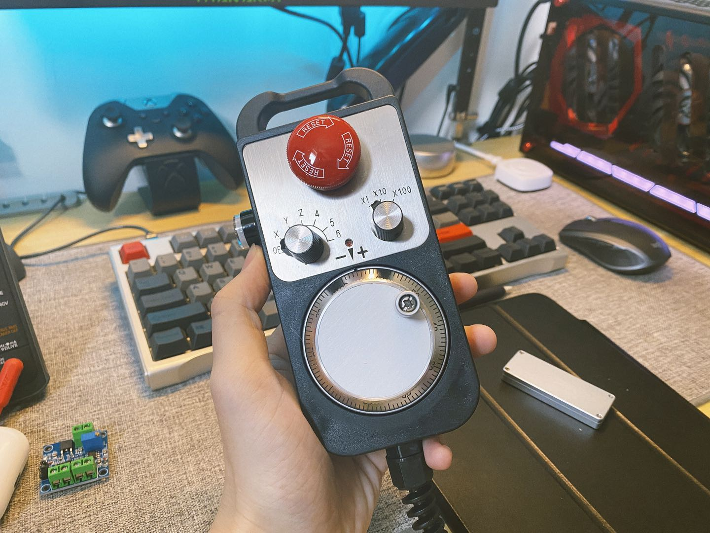

# GRBL_for_STM32
A code transportation from origin grbl_v1.1f to STM32F103VET6, mainly prepare for my MegaCNC project.

> 大家知道我前段时间搞了个很暴力的CNC，原配的控制器很简陋，所以这里打算自己重新设计一个。
>
> 这个仓库是个人移植的STM32版本grbl固件，目前基本所有已经正常工作了，后续计划添加手轮控制功能。（为了添加手轮STM32F103C8T6的IO口不够用所以选用F103VET6）

**手轮长这个样：**

